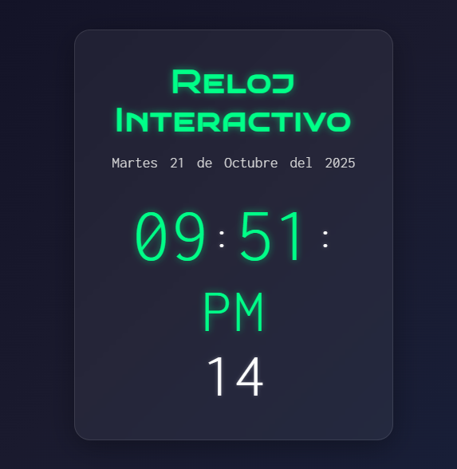

# Interactive Clock

A modern, responsive digital clock with **glassmorphism**, neon glow effects, and real-time updates.

🚀 Live demo   
[View Live Demo](https://marceloadan73.github.io/reloj-interactivo/)

## Technologies
- **HTML5**
- **CSS3** (Flexbox, `backdrop-filter`, CSS variables, transitions)
- **JavaScript** + **jQuery**
- **Google Fonts** (`Bruno Ace SC`, `Inconsolata`)

## Features
- Real-time clock with smooth second updates
- **Glassmorphism** design with blurred background
- **Neon glow** on time separators and AM/PM
- Fully **responsive** (mobile, tablet, desktop)
- Hover effects on date elements
- Clean, modern UI with dark gradient background

---

👨‍💻 Developer  
**Marcelo**  
[View GitHub Profile](https://github.com/MarceloAdan73) 
